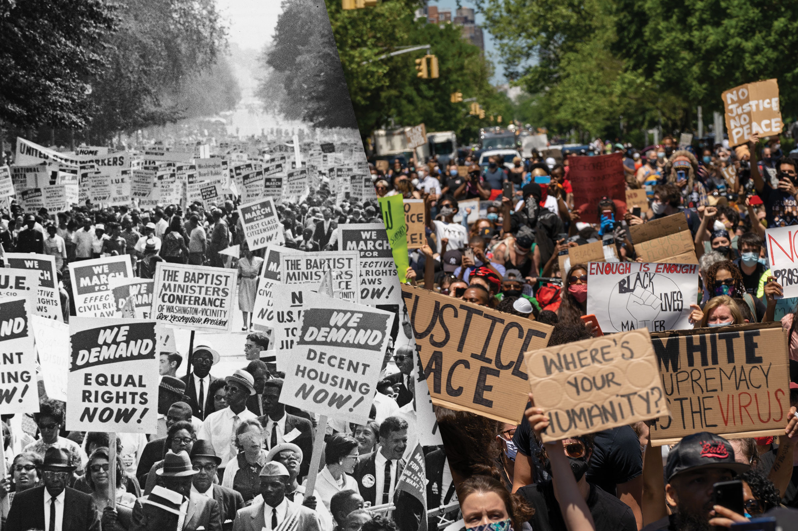

# Assignment 1: Protests
This repository contains code and analysis of protests in the United States, using data from [CountLove](https://countlove.org/).

## Background Research
Before diving into this (or any) dataset, it's important to have _domain familiarity_ (i.e., to know something about the topic). As preparation, you should locate and read _three (3)_ articles about public protests in the U.S.. These can be news articles or more holistic analysis pieces (e.g., as might be in an online magazine or publication).

In this section of the `README.md` file, create an _unordered list_ of the three articles you found. For each article in the list, provide a link to the article (in Markdown formatting, with display text other than the URL) _as well as_ a 1-2 sentence summary or takeaway/thesis from each one.

-[List of famous protests in the U.S.](https://en.m.wikipedia.org/wiki/List_of_protests_in_the_United_States_by_size)
List all of public protests in the U.S. by size from 1999 to now. Tell me that it's everyone's right to use assembles to fight for what they think is right.

-[7 influential Protests in American History](https://www.google.com/amp/s/www.ucf.edu/news/7-influential-protests-in-american-history/%3Famp)
List 7 influential protests in American history which are so important that they even changed the law.It tells me that right to assembles are not fake, it's really a power weapon in eveyone's hand.

-[George Floyd: Huge protests against racism held across US](https://www.google.com/amp/s/www.bbc.com/news/amp/world-us-canada-52951093)
It's showing that most of people are angry and sad when they heared of George Floyd's death. They try teir best to protest, hoping change the racism environment. 

## Representative Image
A picture is, as they say, worth many words. Images are great at increasing engagement with your analysis as well as conveying the point of your analysis. Find and download at least _one (1)_ image to accompany your analysis, saving the file in the provided `img/` folder in your repo.

In this section of the `README.md` file, display the image from your `img/` folder (remember to use a _relative path_!). Below that image, include 2-3 sentences captioning the image. Your caption should both identify the image as well as explain _why_ you included that image in particular. As practice, use either **bold** or _italic_ text when captioning your image.

_This image shows that there are two protests which are all about racism. It's suprising and shocking that equal rights and racism issues are still contraversal and unsolved after so many years. It also tells me that not all protests can make enough influence to change the law._

## Analysis Reflections
As you follow the instructions in the `analysis.R` file, you will be prompted to write six (6) _reflections_ interpreting the results of your code. Those reflections should do in this section.

Each reflection should be about 1-2 sentences long. You can organize the reflections into an _ordered list_ or otherwise label which is which.

## Conclusion
Once you are finished with your analysis (you've completed the `analysis.R` file), fill in this section by answering the following questions (in about 1-2 sentences each):

1. What results from the analysis surprised you? Why?
2. What parts of the analysis did you find most challenging?
3. What kind of analysis do you wish you were able to do with the dataset (but perhaps don't have the technical skills to do so)?